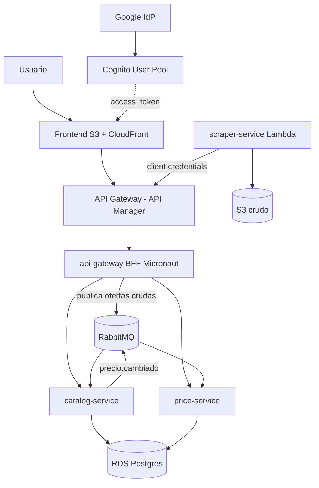

# Arquitectura de Cacha el Precio

> Por qué el sistema está armado así. Este documento existe para responder la pregunta que se
> hace en toda defensa: **"¿por qué no lo hiciste más simple?"**
>
> Complemento del [PLAN.md](PLAN.md) · Última revisión: 19-08-2026

---

## Índice

0. [Vista general del sistema](#vista-general-del-sistema)
1. [El principio que ordena todo](#1-el-principio-que-ordena-todo)
2. [¿Por qué microservicios y no un monolito?](#2-por-qué-microservicios-y-no-un-monolito)
3. [¿Por qué exactamente cuatro servicios?](#3-por-qué-exactamente-cuatro-servicios)
4. [¿Por qué un BFF?](#4-por-qué-un-bff)
5. [¿Por qué un API Manager si ya tengo un BFF?](#5-por-qué-un-api-manager-si-ya-tengo-un-bff)
6. [¿Por qué mensajería y no llamadas directas?](#6-por-qué-mensajería-y-no-llamadas-directas)
7. [¿Por qué Micronaut y no Spring Boot?](#7-por-qué-micronaut-y-no-spring-boot)
8. [¿Por qué Cognito?](#8-por-qué-cognito)
9. [El detalle del `audience` en Cognito](#9-el-detalle-del-audience-en-cognito)
10. [Cómo escala el sistema](#10-cómo-escala-el-sistema)
11. [Lo que decidimos NO hacer](#11-lo-que-decidimos-no-hacer)
12. [Registro de decisiones (ADR)](#12-registro-de-decisiones-adr)

---

## Vista general del sistema


```
                            ┌──────────────────────┐
   Usuario ─── login ──────▶│  Cognito (OIDC)      │◀── Google como IdP federado
                            │  Hosted UI + grupos  │
                            └──────────┬───────────┘
                                       │ JWT (access_token)
                                       ▼
  Frontend (S3+CloudFront) ──▶ ┌───────────────────────────┐
                               │  API GATEWAY (API Manager)│  JWT authorizer · CORS
                               │  stages dev/prod          │  throttling · OpenAPI
                               └─────────────┬─────────────┘
                                             ▼
                                    ┌─────────────────┐
                                    │  api-gateway    │  (BFF en Micronaut, Fargate)
                                    │  agrega datos   │  valida iss/aud/exp/firma/rol
                                    └───┬─────────┬───┘
                                        ▼         ▼
                          ┌──────────────────┐  ┌───────────────────┐
                          │ catalog-service  │  │  price-service    │
                          │ modelos, matching│  │ ofertas, historial│
                          └────────▲─────────┘  └────────▲──────────┘
                                   │                     │
                          ╔════════╧═════════════════════╧════════╗
                          ║            RabbitMQ                   ║
                          ║  exchange: ingesta   → ofertas.crudas ║
                          ║  exchange: dominio   → precio.cambiado║
                          ║  + DLQ para lo que falla              ║
                          ╚════════▲══════════════════════════════╝
                                   │ el BFF publica tras validar el token
                                   │
                   ┌───────────────┴────────────────┐
                   │  POST /ingesta  (por el API Manager)
                   │        con token de client credentials
                   └───────────────▲────────────────┘
                                   │
                   ┌───────────────┴────────────────┐
                   │        scraper-service         │  (Lambda + EventBridge)
                   │  adaptador Sparta (GraphQL)    │
                   │  adaptador Hites  (Jsoup)      │
                   └───────────────┬────────────────┘
                                   ▼
                          crudo guardado en S3  (fuente de verdad, reprocesable)

        Base de datos: RDS Postgres  ·  Secretos: Secrets Manager
```

### 🔄 Cambio importante respecto del plan anterior

Antes, el scraper publicaba **directo a RabbitMQ**. Eso dejaba el token de client credentials sin
validar en ninguna parte — un requisito del ramo quedaba decorativo.

**Ahora el scraper llama a `POST /ingesta` a través del API Manager**, con un token de client
credentials y el scope `ingesta:escribir`. El BFF valida el token y recién ahí publica al exchange
`ingesta`.

Con eso ganamos tres cosas:
1. El flujo **client credentials se valida de verdad**, y se puede demostrar.
2. **Ningún componente entra al sistema sin pasar por el API Manager**, ni siquiera los nuestros
   — frase directa para la presentación.
3. Suma rutas al API Manager, que es el 13% de EP2.

<details>
<summary>Mismo diagrama en Mermaid (para el informe en GitHub)</summary>


</details>

### Por qué cada pieza existe

Resumen. La justificación completa, con alternativas descartadas, está en
[ARQUITECTURA.md](ARQUITECTURA.md).

| Pieza | Por qué está separada |
|---|---|
| `scraper-service` | Corre por horario, no por request; falla distinto (una tienda caída no debe botar el resto); es el único que necesita salir a internet |
| **RabbitMQ** | Desacopla ingesta de procesamiento: si el normalizador está caído, las ofertas esperan en la cola en vez de perderse. Con **DLQ** y reintentos con backoff |
| `catalog-service` | Dueño de los modelos canónicos y del matching (la lógica pesada del dominio) |
| `price-service` | Carga distinta: escritura masiva 3 veces al día, lectura intensa. Se escala y cachea aparte |
| `api-gateway` (BFF) | Única puerta al frontend; junta catálogo + precios en una respuesta y valida el token |
| **API Gateway de AWS** | El API Manager: valida el token en el borde, aplica CORS y cuotas, versiona la API |
| S3 con el crudo | Fuente de verdad. Cuando una tienda cambie su HTML, se reprocesa sin volver a scrapear |

---

## 1. El principio que ordena todo

Cada pieza de esta arquitectura existe porque **algo en el sistema cambia a un ritmo distinto o
falla de una manera distinta**. Ese es el criterio, y se aplica igual a los cuatro servicios.

| Componente | Cambia cuando… | Falla cuando… | Se escala por… |
|---|---|---|---|
| `scraper-service` | una tienda cambia su HTML o su API | la tienda está caída o nos bloquea | cantidad de tiendas |
| `catalog-service` | cambia la lógica de matching | llega un producto raro que no matchea | cantidad de productos |
| `price-service` | cambia el cálculo del descuento | la BD se satura de escrituras | volumen de historial |
| `api-gateway` (BFF) | cambia lo que el frontend necesita | hay muchos usuarios simultáneos | tráfico de usuarios |

Si dos piezas cambian juntas, van juntas. Si cambian por separado, se separan. **No se separan
por moda ni por cumplir con "hacer microservicios".**

Contraejemplo real de nuestro propio proyecto: `catalog` y `price` **podrían** ser uno solo —
comparten base de datos y el mismo dominio de negocio. Los separamos porque tienen perfiles de
carga opuestos (uno escribe en ráfagas 3 veces al día, el otro lee todo el tiempo), y esa es una
razón legítima. Si no tuviéramos esa razón, serían un servicio.

---

## 2. ¿Por qué microservicios y no un monolito?

Respuesta honesta primero: **para el volumen de este proyecto, un monolito bien hecho
funcionaría.** Es importante decirlo, porque un equipo que no puede admitir eso no entendió
la decisión.

Ahora las razones por las que igual se justifican acá:

**a) El scraper tiene un perfil de ejecución incompatible con el resto.**
Corre 3 veces al día durante ~30 segundos y el resto del tiempo no hace nada. Si viviera dentro
del monolito, tendríamos un servidor prendido 24/7 para trabajo que ocupa 90 segundos diarios.
Separado, es una **Lambda que cuesta prácticamente cero**. Esa es una diferencia de costo real,
no teórica.

**b) El scraper es la única pieza que sale a internet hacia sitios ajenos.**
Es la que puede quedar bloqueada, la que puede colgarse esperando un timeout, la que se rompe
cuando Hites cambia su HTML. **Aislarla significa que una tienda caída no bota la web.**

**c) Las cargas son genuinamente distintas.** `price-service` recibe escrituras masivas en
ráfaga y lecturas constantes; `catalog-service` hace trabajo de CPU (normalización y comparación
de texto). Separados se escalan y cachean por separado.

**d) Es requisito del ramo.** También hay que decirlo. Pero las tres razones de arriba se
sostienen solas, y esa es la diferencia entre una arquitectura justificada y una decorativa.

### La contra que hay que reconocer

Los microservicios tienen un costo: latencia de red entre servicios, transacciones distribuidas,
más piezas que desplegar y observar. Lo asumimos porque el sistema es de **lectura intensiva y
consistencia eventual** — que un precio se refleje 10 segundos más tarde no le hace daño a nadie.
Si esto fuera un sistema de pagos, la decisión sería otra.

---

## 3. ¿Por qué exactamente cuatro servicios?

No es un número arbitrario. Es el resultado de aplicar el criterio de la sección 1 y **frenar
ahí**, en vez de seguir dividiendo.

| Servicio | Responsabilidad única | Por qué no está fusionado con otro |
|---|---|---|
| `scraper-service` | Obtener datos crudos de las tiendas | Perfil de ejecución y modo de falla completamente distintos |
| `catalog-service` | Dueño de los modelos canónicos y del matching | Es la lógica pesada del dominio; el resto no debe depender de ella para responder |
| `price-service` | Ofertas, historial y cálculo del descuento real | Carga de escritura masiva vs. lectura intensa |
| `api-gateway` (BFF) | Componer respuestas para el frontend y validar el token | Es la capa de presentación; cambia con el frontend, no con el dominio |

### Servicios que decidimos NO crear

Esto es igual de importante que los que sí creamos:

- **`user-service`** — Cognito ya es el dueño de los usuarios. Crear un servicio de usuarios
  sería duplicar la fuente de verdad de la identidad. Lo único nuestro es el `sub` del JWT como
  llave foránea en la tabla `seguimiento`.
- **`search-service`** — Postgres con `pg_trgm` alcanza de sobra para el volumen del MVP.
  Meter Elasticsearch sería complejidad sin problema que la justifique.
- **`alert-service`** — está diseñado pero **no construido**. Es el argumento de extensibilidad:
  cuando se agregue, se suscribe al evento `precio.cambiado` que ya existe, **sin tocar una línea
  del código actual**.

> Esa última fila es la mejor frase de la defensa: *"la arquitectura ya está preparada para las
> alertas, y agregarlas no requiere modificar ningún servicio existente"*.

---

## 4. ¿Por qué un BFF?

El **Backend For Frontend** es un servicio cuyo único cliente es nuestro frontend, y cuya única
responsabilidad es darle exactamente lo que necesita.

**El problema que resuelve, con un caso concreto.** Para pintar la ficha de un producto, el
frontend necesita: el modelo canónico (de `catalog`), los precios por tienda (de `price`), el
historial para el gráfico (de `price`) y si el usuario lo sigue (de `price`). Sin BFF, eso son
**tres o cuatro llamadas desde el navegador**, cada una con su latencia, su manejo de errores y
su token. Con BFF, es **una**.

**Las cuatro razones:**

1. **Menos viajes de red desde el navegador.** Sobre una conexión móvil chilena, cuatro llamadas
   secuenciales se notan; una no.
2. **El frontend no necesita conocer la topología interna.** Si mañana `price-service` se parte
   en dos, el frontend no se entera. **Ese desacople es lo que hace escalable el sistema.**
3. **Es el punto donde se aplica la autorización de negocio.** El API Gateway valida que el token
   sea legítimo (firma, issuer, vigencia). El BFF valida **qué puede hacer este usuario en
   particular** — por ejemplo, que solo pueda ver su propia lista de seguimiento. Son dos
   preguntas distintas y se responden en lugares distintos.
4. **Es lo que la rúbrica pide validar** (issuer, audience, firma, vigencia, rol).

### El BFF y el API Gateway no hacen lo mismo

Esta es la pregunta trampa clásica. La respuesta:

| | API Gateway de AWS | BFF (`api-gateway` en Micronaut) |
|---|---|---|
| Qué es | Infraestructura administrada | **Código nuestro** |
| Qué pregunta responde | *¿este token es legítimo?* | *¿este usuario puede hacer esto?* |
| Qué valida | Firma, issuer, audience, expiración | Roles, pertenencia del recurso, reglas de negocio |
| Si falla | Devuelve 401 sin que el backend se entere | Devuelve 403 con un mensaje del dominio |
| Conoce el dominio | No | Sí |

**Defensa en profundidad:** el token se valida dos veces, en dos capas independientes. Si alguien
lograra llegar al BFF saltándose el gateway (por ejemplo desde dentro de la VPC), el BFF **igual
rechaza** el request. Un servicio que confía ciegamente en que "alguien antes ya validó" es un
servicio vulnerable.

---

## 5. ¿Por qué un API Manager si ya tengo un BFF?

Porque resuelven problemas de capas distintas. El API Manager hace cinco cosas que **no
corresponde** poner en el código de la aplicación:

| Función | Por qué va en el borde y no en el código |
|---|---|
| **Validar el JWT** | Un token inválido se rechaza **antes** de gastar cómputo en Fargate. Es más barato y más seguro |
| **CORS** | Es una política de infraestructura. Cambiar los orígenes permitidos no debería requerir un deploy |
| **Throttling y cuotas** | Protege contra abuso sin que la aplicación tenga que preocuparse |
| **Stages (`dev` / `prod`)** | Permite versionar la API y probar sin afectar producción |
| **Documentación (OpenAPI)** | Un solo lugar donde vive el contrato público de la API |

**La regla de oro del diseño:** *ningún servicio está expuesto directo a internet.* Los cuatro
viven en subredes privadas y la única puerta de entrada es el API Gateway.

**Y esto incluye a nuestros propios componentes.** El scraper no publica directo a RabbitMQ:
llama a `POST /ingesta` a través del API Manager, con un token de **client credentials** y el
scope `ingesta:escribir`. Recién ahí el BFF publica a la cola.

Es un salto de red extra a cambio de tres cosas:
1. El token de máquina **se valida de verdad** en vez de ser decorativo.
2. La superficie de ataque queda en un solo lugar auditable.
3. Se puede decir con propiedad: **"ningún componente entra al sistema sin pasar por el API
   Manager, ni siquiera los nuestros"**.

---

## 6. ¿Por qué mensajería y no llamadas directas?

El scraper podría llamar a `catalog-service` por HTTP y listo. No lo hacemos por tres razones:

**a) Los datos no se pierden.** Si `catalog-service` está caído, reiniciándose o desplegándose,
una llamada HTTP falla y **la captura se perdió**. Con la cola, los mensajes esperan. Como el
scraper corre 3 veces al día, una captura perdida es un hueco de 8 horas en el historial que no
se puede recuperar.

**b) Los ritmos son distintos.** El scraper produce cientos de ofertas en ráfaga; el matching es
trabajo de CPU que toma su tiempo. Sin cola, el scraper tendría que esperar al consumidor. La
cola es el amortiguador entre los dos.

**c) Extensibilidad sin tocar el código existente.** El evento `precio.cambiado` hoy lo consume
solo `price-service`. Cuando agreguemos `alert-service`, se suscribe al mismo evento y funciona.
Con llamadas HTTP directas, habría que **modificar el productor** para que llame también al
servicio nuevo — y ahí se acabó el desacople.

### Cómo se maneja lo que sale mal

| Problema | Solución |
|---|---|
| Un mensaje falla al procesarse | 3 reintentos con **backoff exponencial** |
| Sigue fallando después de 3 | Va a la **DLQ** (`ofertas.crudas.dlq`) y se revisa aparte, sin trabar la cola |
| El mismo mensaje llega dos veces | **Clave de idempotencia** con `UNIQUE` en la BD (ver abajo) |
| RabbitMQ se reinicia y pierde mensajes | Se reprocesan desde el **crudo en S3** |

### Cómo queda configurada la mensajería


- **Exchange `ingesta`** (*direct*) → cola `ofertas.crudas`: el BFF publica cada oferta recibida,
  `catalog-service` la consume, normaliza y matchea.
- **Exchange `dominio`** (*topic*) → evento `precio.cambiado`: cuando un precio se mueve,
  `price-service` lo registra en el historial. Más adelante, `alert-service` se suscribe al mismo
  evento **sin tocar el código existente** — ese es el argumento de extensibilidad para la defensa.
- **DLQ** (`ofertas.crudas.dlq`): lo que falla tres veces se aparta en vez de trabar la cola.
- En Micronaut: `micronaut-rabbitmq` con `@RabbitClient` para publicar y `@RabbitListener` para consumir.

### Idempotencia: el detalle que se pregunta siempre

RabbitMQ garantiza **at-least-once**, no exactly-once. Si el consumidor procesa un mensaje y se
cae antes de mandar el ACK, el mensaje **se vuelve a entregar**. Sin protección, el historial de
precios tendría duplicados — y el historial es el dato del que depende todo el producto.

**Solución:** cada mensaje lleva `clave_idempotencia = hash(tienda + sku_externo + capturado_en)`,
y `precio_historico` tiene un `UNIQUE` sobre esa columna. Si llega repetido, la inserción se
rechaza y se descarta sin ruido. El consumidor es idempotente por construcción.

---

## 7. ¿Por qué Micronaut y no Spring Boot?

La pauta menciona Spring Boot en su caso de ejemplo, pero la elección de tecnología es libre
mientras se justifique. La nuestra:

**La diferencia técnica de fondo:** Spring resuelve la inyección de dependencias **en tiempo de
ejecución, usando reflexión**. Micronaut la resuelve **en tiempo de compilación**, generando el
código necesario. Eso tiene dos consecuencias medibles:

| | Spring Boot | Micronaut |
|---|---|---|
| Arranque en frío | ~2–5 segundos | **~50–100 ms** |
| RAM en reposo | ~250–400 MB | **~50–80 MB** |
| Compilación nativa (GraalVM) | Posible, con trabajo | Diseñado para eso desde el inicio |

**Por qué eso importa en *este* proyecto específicamente:**

1. **El scraper es una Lambda.** El arranque en frío se paga **en cada invocación**. Con Spring,
   una parte importante del tiempo de ejecución sería el framework levantándose. Con Micronaut es
   despreciable. Este es el argumento más fuerte y es concreto.

2. **El crédito de AWS Academy es limitado.** En Fargate se paga por vCPU y por GB de RAM
   asignados. Cuatro servicios que necesitan 4x menos memoria son cuatro servicios que cuestan
   menos, y eso decide si llegamos al final del semestre con crédito.

3. **Es la idea central de "cloud native".** Un framework diseñado para arrancar rápido, ocupar
   poco y escalar horizontalmente es exactamente lo que el ramo trata. Elegirlo *es* el argumento.

**El costo, dicho con honestidad:** Spring tiene mucho más material, más respuestas en Stack
Overflow y más gente que lo conoce. Micronaut tiene una comunidad más chica. Lo asumimos porque
la API es muy parecida (`@Controller`, `@Inject`, `@Get` se ven casi igual) y porque el equipo ya
tiene experiencia previa con Java.

---

## 8. ¿Por qué Cognito?

| Alternativa | Por qué no |
|---|---|
| **Autenticación propia** | Guardar contraseñas es un riesgo que no hay razón para tomar. Además el ramo pide un **IDaaS** |
| **Keycloak self-hosted** | Es excelente, pero lo mantenemos nosotros, consume una tarea de Fargate 24/7 del crédito, y **no es un servicio administrado** — que es justamente lo que el ramo quiere enseñar |
| **Azure Entra / Auth0** | Ambos válidos. Cognito gana porque **todo el cómputo ya está en AWS**: el JWT Authorizer de API Gateway se integra nativamente y no hay que configurar nada extra |

**Lo que Cognito nos da sin escribir código:** registro con verificación por email, política de
contraseñas, recuperación de clave, MFA opcional, Google como IdP federado, rotación de llaves,
JWKS público, y los tres flujos OAuth2 que necesitamos.

Y una razón de arquitectura: **la identidad queda desacoplada del cómputo**. El frontend habla
directo con Cognito, obtiene el token, y recién entonces habla con nuestra API. Nuestros servicios
nunca ven una contraseña. Si mañana cambiamos de IDaaS, se cambia el issuer y el JWKS, y los
servicios siguen validando igual — porque validan **JWT estándar**, no "tokens de Cognito".

### Scopes y roles definidos

### La búsqueda de precios es pública

Si obligamos a loguearse para ver precios, matamos el producto. La autenticación protege lo que
es *del usuario*: su lista de seguimiento y, más adelante, sus alertas.

| Scope / rol | Quién | Protege |
|---|---|---|
| `precios:leer` | público, sin token | Búsqueda y ficha de producto |
| `seguimiento:escribir` | usuario autenticado | Lista de seguimiento personal |
| `ingesta:escribir` | solo máquinas (client credentials) | Endpoint de ingesta |
| grupo `admin` | administrador | Endpoints de gestión → devuelven **403** al usuario común |

El grupo `admin` no es decorativo: sin roles, la API solo puede responder 200 y 401. Con roles
aparece el **403** (autenticado pero sin permiso), que es la diferencia entre *autenticación* y
*autorización* — y es la distinción que se pregunta en la defensa.

---

---

## 9. El detalle del `audience` en Cognito

Vale la pena tenerlo claro, porque es donde más gente se equivoca.

### Cognito emite tres tokens y cada uno sirve para algo distinto

| Token | Para qué es | Claims relevantes |
|---|---|---|
| `id_token` | **Quién es el usuario.** Para que el frontend muestre el nombre | `sub`, `email`, `aud` ✅, `nonce`, `cognito:groups` |
| `access_token` | **Qué puede hacer.** Es el que se manda a la API | `sub`, `client_id`, `scope`, `token_use`, `cognito:groups` — **sin `aud`** ⚠️ |
| `refresh_token` | Renovar los otros dos sin volver a loguearse | (opaco) |

**El error común** es mandar el `id_token` a la API porque "tiene el `aud` que pide la rúbrica".
Es incorrecto en OAuth2: el `id_token` es para el cliente, no para autorizar llamadas. Nosotros
mandamos el **`access_token`**, que es lo correcto.

### Entonces, ¿cómo validamos la audiencia?

**En el API Gateway (JWT Authorizer):**
```
Issuer:   https://cognito-idp.us-east-1.amazonaws.com/<userPoolId>
Audience: <clientId>
```
Cuando el token viene de Cognito y no trae `aud`, AWS compara ese valor contra el claim
`client_id`. El efecto es el mismo: **un token emitido para otra aplicación es rechazado.**

**En el BFF (Micronaut), validamos explícitamente:**

| Qué | Contra qué | Qué pasa si falla |
|---|---|---|
| Firma | JWKS público de Cognito | 401 |
| `iss` | Nuestro User Pool | 401 |
| `client_id` | Nuestro clientId | 401 |
| `token_use` | Debe ser `"access"` | 401 — rechaza un `id_token` mandado por error |
| `exp` | Hora actual | 401 |
| `cognito:groups` | El rol que la ruta exige | **403** |

Esa tabla es la respuesta completa a *"¿cómo validan el token?"*, y el `token_use` es el detalle
que demuestra que entendimos la diferencia entre los tres tokens.

---

## 10. Cómo escala el sistema

Escalar no es solo "poner más servidores". Estas son las tres dimensiones por las que este
sistema puede crecer, y qué pasa en cada una:

### a) Más tiendas

Es la dimensión más probable. El diseño lo resuelve con el **patrón adaptador**: cada tienda es
una implementación de la misma interfaz.

```java
public interface AdaptadorTienda {
    List<OfertaCruda> capturar(String marca);
}
```

Agregar Falabella es escribir `AdaptadorFalabella`, registrarlo, y nada más. **Ni el catálogo, ni
los precios, ni el BFF, ni el frontend cambian.** Por eso las tiendas están en una tabla de la BD
y no hardcodeadas.

### b) Más usuarios

- El frontend es estático en **S3 + CloudFront** → escala solo, es CDN.
- El **API Gateway** administrado absorbe el tráfico sin configuración nuestra.
- El **BFF y `price-service` escalan horizontalmente** en Fargate: no guardan estado, así que
  levantar más tareas funciona sin coordinación.
- Cuello de botella real: **RDS**. Se resuelve con réplicas de lectura, porque el sistema es
  mayoritariamente de lectura.

### c) Más productos e historial

`precio_historico` es la tabla que crece: 2 tiendas × ~500 productos × 3 capturas diarias ≈
**3.000 filas al día**. A un año son ~1,1 millones — trivial para Postgres con el índice
`(variante_id, capturado_en DESC)`.

Si creciera de verdad, el camino ya está pensado: **particionar por mes** y archivar en S3 lo más
viejo de un año. No lo implementamos ahora porque sería resolver un problema que no tenemos, pero
saber cuál es el siguiente paso es parte de defender el diseño.

### Lo que hace que todo esto sea posible

1. **Servicios sin estado** — cualquier réplica atiende cualquier request.
2. **La cola como amortiguador** — un peak de ingesta no tumba a los consumidores.
3. **S3 como fuente de verdad** — se puede reconstruir la BD completa desde el crudo.
4. **Configuración por entorno** — la misma imagen corre en `dev` y en `prod`.

---

## 11. Lo que decidimos NO hacer

Un diseño se defiende tanto por lo que descarta como por lo que incluye.

| Descartado | Por qué | Qué hacemos en cambio |
|---|---|---|
| **EKS (Kubernetes)** | El control plane cuesta ~USD 73/mes y se come el crédito. Además, orquestar 4 servicios no necesita Kubernetes | **ECS Fargate** |
| **Amazon MQ** | ~USD 22/mes por RabbitMQ administrado | **RabbitMQ en un contenedor Fargate** |
| **Volumen persistente para RabbitMQ** | Requiere montar EFS: complejidad y costo | **La cola es efímera**; si se pierde algo, se reprocesa desde S3 |
| **Elasticsearch** | Complejidad sin un problema que la justifique | **`pg_trgm` en Postgres**, que ya está ahí |
| **Base de datos por servicio** | Correcto en teoría, pero con crédito limitado son 2+ instancias RDS | **Una instancia, un esquema por servicio**. Aísla el modelo sin duplicar el costo |
| **Dominio propio** | Cuesta plata y no aporta nada al MVP | La URL de **CloudFront** |
| **App móvil nativa** | Duplicaría el frontend | **Web responsive** |
| **Playwright en el MVP** | Es caro en tiempo de desarrollo y en cómputo | Dos tiendas que se resuelven con **HTTP simple**; Playwright queda post-MVP |

> **"Una instancia de RDS con un esquema por servicio"** es una decisión que hay que saber
> defender: reconoce el principio de *database per service* y explica por qué se desvía —
> restricción de presupuesto — manteniendo el aislamiento lógico. Eso es criterio de ingeniería,
> no desconocimiento del patrón.

---

## 12. Registro de decisiones (ADR)

Cada decisión importante va en `adr/` como un archivo de una página con este formato:

```markdown
# ADR-00X · <Título de la decisión>

**Fecha:** DD-MM-AAAA
**Estado:** aceptada | reemplazada por ADR-00Y

## Contexto
Qué situación nos obligó a decidir.

## Alternativas consideradas
Qué evaluamos y por qué se descartó cada una.

## Decisión
Lo que elegimos.

## Consecuencias
Lo bueno y lo malo que aceptamos. **Especialmente lo malo.**
```

### ADRs a escribir

| # | Decisión | Sección de referencia |
|---|---|---|
| 001 | Micronaut en vez de Spring Boot | §7 |
| 002 | Cuatro microservicios, y por qué no más ni menos | §2, §3 |
| 003 | BFF además del API Manager | §4, §5 |
| 004 | RabbitMQ en vez de llamadas HTTP directas | §6 |
| 005 | El scraper ingesta por el API Manager, no directo a la cola | §5 |
| 006 | Cognito como IDaaS | §8 |
| 007 | La búsqueda de precios es pública, sin token | [ARQUITECTURA.md §8](ARQUITECTURA.md#8-por-qué-cognito) |
| 008 | ECS Fargate en vez de EKS | §11 |
| 009 | RabbitMQ autoadministrado en vez de Amazon MQ | §11 |
| 010 | Una instancia RDS con esquema por servicio | §11 |
| 011 | S3 como fuente de verdad, no la base de datos | §10 |
| 012 | Cola efímera, sin EFS | §11 |
| 013 | Java 25 y Maven como base del backend | [`ADR-013`](adr/013-java-25-maven.md) |
| 014 | Versionado semántico independiente por microservicio | [`ADR-014`](adr/014-versionado-semantico-por-servicio.md) |

**Por qué vale la pena:** el razonamiento ya está escrito acá, así que es mayormente copiar y
pegar. Y en una defensa, un ADR que dice *"consideramos X, lo descartamos porque Y, y aceptamos
la consecuencia Z"* demuestra criterio de ingeniería — que es lo que se está evaluando cuando
preguntan "¿por qué?".

---
